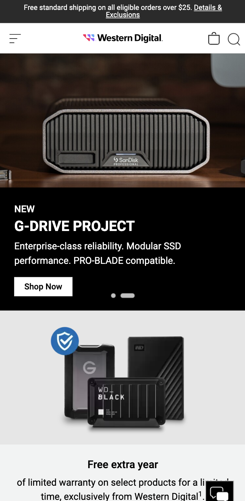
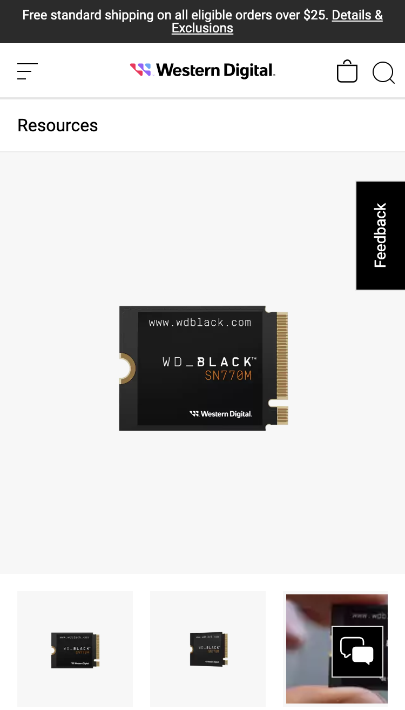
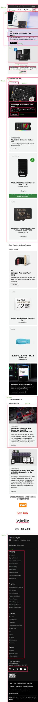
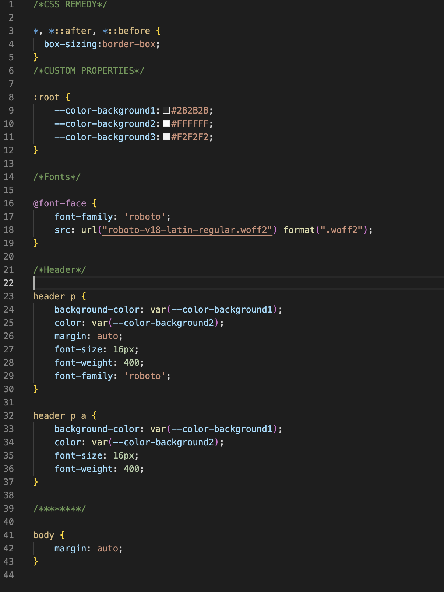
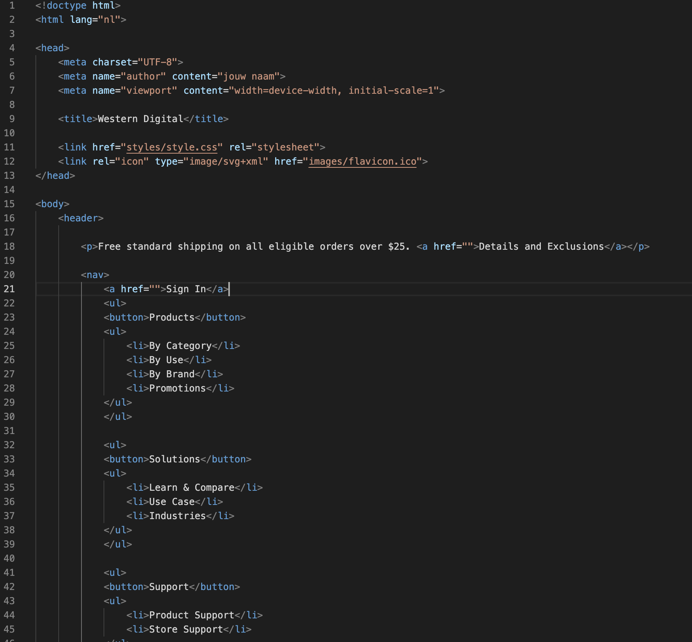

# Procesverslag

## Jij

  ### Auteur:
  Martin Schaapherder

  #### Je startniveau:
  Rood

  #### Je focus:
  Responsive
 

## Je website

  ### Je opdracht:
  [Western Digital](https://www.westerndigital.com/)

  #### Screenshot(s) van de eerste pagina (small screen): 

  Homepage
  

  #### Screenshot(s) van de tweede pagina (small screen):
  Product pagina 
  
  
 

## Toegankelijkheidstest 1/2 (week 1)

  ### Bevindingen
  Lijst met je bevindingen die in de test naar voren kwamen:

  - Headings worden duidelijk uitgesproken en zijn goed te navigeren.
  
  - Links van producten zijn erg duidelijk er wordt gezegd welk product het om gaat en hoeveel het kost.
  
  - Learn more links geven ook aan waar de Learn more link over gaat.
  

## Breakdownschets (week 1)

  ### de hele pagina: 
  

## Voortgang 1 (week 2)

  
uitwerken voor 1e voortgang

  ### Stand van zaken

  Ik heb een klein beginnetje kunnen maken maar nog niet zoveel als ik wou door gebrek aan tijd.
  Ik ben bezig geweest met de fonts goed te krijgen en wat html structuur maar dat is nog niet helemaal af/gelukt.

  
  

  ### Agenda voor meeting
 

  Punten per student uit mijn groepje

  Martin

  - Maakt het uit wat voor soort bestand een afbeelding is? (Ex. png svg jpg webp)
  - Hoe hou ik dit icoontje altijd de zelfde plek in het scherm
  - hoe zorg ik dat iets verdwijnt als ik scroll
  - Welke waardes zijn het handigst om te gebruiken als je alles responsive wil houden?

  Rosalie

  - hoe laat ik een uitklapmenu groeien
  - hoe vergroot ik een image binnen een bepaalde box zonder dat die er buiten komt

  Leanne

  - hoe maak je de afbeelding van het logo een hidden H1 in de HTML?
  - Moet er voor de ul een nav?
  - bij H2 "populair" waar doe je een img tag?
  - Hoe schrijf ik een bepaald stukje van de HTML van de footer?

  Chimene

  - Hoe kan ik knoppen/afbeeldingen juist downloaden van de website
  - Hoe kan ik het lettertype van mijn website nu in mijn css krijgen
  - Maakt het uit of je png gebruikt of moet je svg gebruiken
  - Meerdere links stylen tegelijk in css. doe ik nu met classes, maar kan dit ook makkelijker

  Kim

  - Hoe maak je een pauze knop voor een carrousel?  
  - Hoe maak ik de gekleurde ronde onderkanten bij de sections?
  - Hoe loop je een animatie? 
  - Waarvoor mocht je nou precies wel een class voor gebruiken?

  ### Verslag van meeting
  
  - al mijn vragen zijn beantwoord en ik nog aardig wat geleerd van de vragen van mijn mede studenten.
    

## Voortgang 2 (week 3)

  ### Stand van zaken
  hier dit ging goed & dit was lastig
  
  - ik moet een carousel maken maar geen idee hoe ik dit moet doen.
  - af en toe frustrerende dingen maar uiteindelijk kom ik er wel uit.
  - het gaat wel oke maar ik moet er meer tijd insteken anders raak ik achter.

    vergeten fotos te maken

  ### Agenda voor meeting
  
  Martin

- Hoe krijg ik dit icoon helemaal links
- Hoe maak ik dit carousel
- Hoe is dit handig om te maken met grid.
- Moeten alle buttons naar iets leiden?

  Rosalie
  
- hoe krijg ik mijn text over een header
- hoe laat ik mijn uitklapmenu groeien

  Leanne

  - hoe maak je de afbeelding van het logo een hidden H1 in de HTML?
  - Moet er voor de ul een nav?
  - bij H2 "populair" waar doe je een img tag?
  - Hoe schrijf ik een bepaald stukje van de HTML van de footer?

  Chimene

- Hoe connect ik mijn tweede CSS bestand juist aan de html?
- Mijn nav werkt niet :(
- Hoe doe ik ook alweer het juiste lettertype importeren?
- Hoe verwijder je iets op Github?

  Kim

 - Lettertype toepassen werkt niet bij de  H2 (?)
  - background-size: cover; geeft error aan?
  - Hoe fix ik de nav button

  ### Verslag van meeting

- ik ben goed geholpen door de student assistenten en ik kan weer verdre met coderen.
- ik heb een beter idee van hoe ik verder kan gaan met een carousel maar het gaat niet heel makkelijk worden

## Toegankelijkheidstest 2/2 (week 4)

  
uitwerken na test in 9e werkgroep

  ### Bevindingen
  Lijst met je bevindingen die in de test naar voren kwamen (geef ook aan wat er verbeterd is):

## Voortgang 3 (week 4)

  
uitwerken voor 3e voortgang

  ### Stand van zaken
  - ik had vooral problemen met het mijn nav bar die niet bleef staan en er zit nog een element boven die wel weg moet als er gescrold wordt
  - voor de rest ging het prima maar ik moet er nog meer tijd in steken om wat meer resultaat te zien, want het lukt wel maar het kost gewoon veel tijd
    
  vergeten fotos te maken

  ### Agenda voor meeting
  
 Martin

- Hoe zorg ik ervoor dat de nav bar blijft staan
- Mag ik hier classes gebruiken?
- Gebruik van pixels

  Rosalie
  
- 

  Leanne

- Het juiste lettertype werkt niet
- Hoe doe je de zoekbalk in de header een rij naar onder
- Hoe zet ik de H2 en A (Tickets) op de goede positie
- Hoe verander ik volgorde van afbeelding + plaatje? Met flex? Bij “Uitgelicht”
- Het paarse lijntje onder “Recent bekeken” en “Populair” hoe kan ik dat het beste doen?

  Chimene

- meer uitleg over @media Queries. 
- wil een border om mijn element, maar ik krijg het niet voor elkaar.
- Jusitify conent lijkt niet te werken 
- Hoe krijg ik een afbeelding links en tekst rechts met flex? 

  Kim

- Hoe fix ik de padding bij de icoontjes in de NAV?
- Hoe voeg ik een to top button toe
- Hoe zat het ook en weer met de 2e pagina en de stylesheets?
- -webkit-background-clip: text; geeft een error, is dat OK?
- Waar kan ik het beste terecht als ik hierna tegen problemen oploop met Javascript?

  ### Verslag van meeting
  
  - eindelijk het probleem met de navbar opgelost.
  - ik weet wat ik moet doen en dat is meer coderen en er meer tijd in steken.

## Eindgesprek (week 5)

  
uitwerken voor eindgesprek

  ### Je uitkomst - karakteristiek screenshots:
  

  ### Dit ging goed/Heb ik geleerd: 
  Korte omschrijving met plaatjes

  

  ### Dit was lastig/Is niet gelukt:
  Korte omschrijving met plaatjes

  

## Bronnenlijst

 1. https://assets.codepen.io/274456/ui-icon-cross.svg icoontjes

 2. http://svgicons.sparkk.fr/ voor icoontjes

 3. https://www.westerndigital.com/ voor images en design

 4. https://icons8.com/icons/set/x icoon
    
 6. https://chat.openai.com/ ik heb het carousel gemaakt met behulp van chatgpt in de code staat precies wat door de ai bot is geschreven. Ik heb ook chatgpt af en toe gebruikt voor kleine vragen hoe ik iets kom doen of bijvoorbeeld om mijn code op te schonen.
  
 8. https://www.w3schools.com/ voor kleine vragen.
    
 9. https://css-tricks.com/snippets/css/a-guide-to-flexbox/ voor flex gerelateerde dingen.

 10. https://codepen.io/shooft/live/MWZYoqa hamburger menu van Sanne

 11. https://codepen.io/siiron/pen/QWwLoMy?editors=1100 css image carousel.

 12. https://www.unicodepedia.com/unicode/miscellaneous-symbols/2605/black-star/ icoontjes

 13. https://grid.layoutit.com/
  

